# Cloudmini — Workflow từng URL

---

## Auth

### `/login` & `/register`
```mermaid
flowchart TD
    A[Mở /login] --> B[Nhập email + password]
    B --> C[POST /auth/login]
    C -->|200| D{role?}
    C -->|401| E[Toast error → retry]
    D -->|admin| F[/admin]
    D -->|reseller| G[/reseller]
    D -->|user| H[/dashboard]
    
    A2[Mở /register] --> B2[Nhập tên + email + password]
    B2 --> C2[POST /auth/register]
    C2 -->|201| D2[Toast success → /login]
    C2 -->|409| E2[Toast: Email đã tồn tại]
```

---

## User Flows

### `/dashboard`
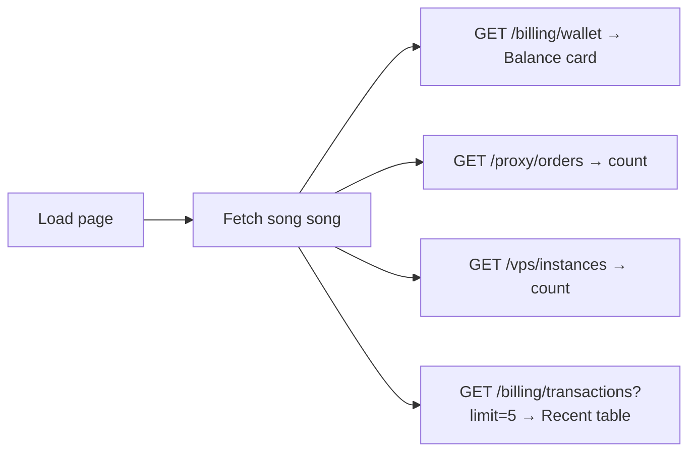
```mermaid
flowchart LR
    A[Load page] --> B[Fetch song song]
    B --> C[GET /billing/wallet → Balance card]
    B --> D[GET /proxy/orders → count]
    B --> E[GET /vps/instances → count]
    B --> F[GET /billing/transactions?limit=5 → Recent table]
```

---

### `/dashboard/proxy`
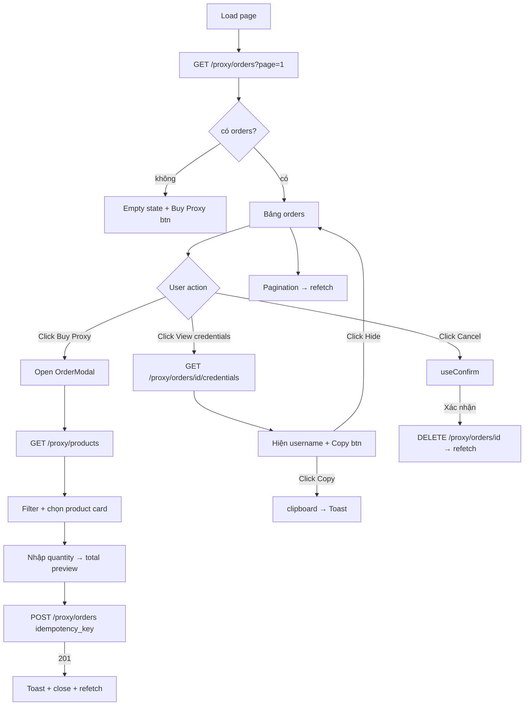
```mermaid
flowchart TD
    A[Load page] --> B[GET /proxy/orders?page=1]
    B --> C{có orders?}
    C -->|không| D[Empty state + Buy Proxy btn]
    C -->|có| E[Bảng orders]

    E --> F{User action}
    F -->|Click Buy Proxy| BUY[Open OrderModal]
    BUY --> BUY2[GET /proxy/products]
    BUY2 --> BUY3[Filter + chọn product card]
    BUY3 --> BUY4[Nhập quantity → total preview]
    BUY4 --> BUY5[POST /proxy/orders idempotency_key]
    BUY5 -->|201| BUY6[Toast + close + refetch]

    F -->|Click View credentials| G[GET /proxy/orders/id/credentials]
    G --> H[Hiện username + Copy btn]
    H -->|Click Copy| I[clipboard → Toast]
    H -->|Click Hide| E

    F -->|Click Cancel| J[useConfirm]
    J -->|Xác nhận| K[DELETE /proxy/orders/id → refetch]

    E --> N[Pagination → refetch]
```

---

### `/dashboard/vps`
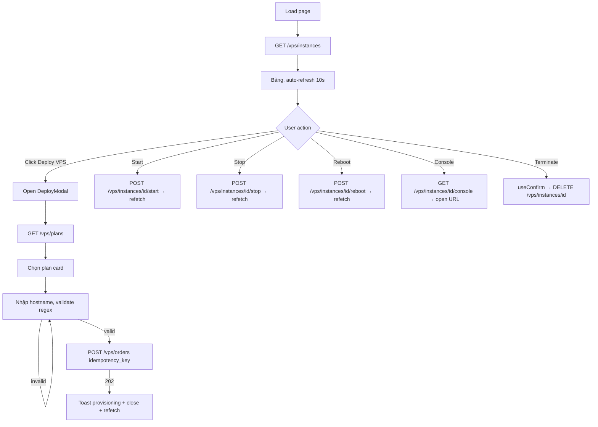
```mermaid
flowchart TD
    A[Load page] --> B[GET /vps/instances]
    B --> C[Bảng, auto-refresh 10s]
    C --> F{User action}

    F -->|Click Deploy VPS| DEP[Open DeployModal]
    DEP --> DEP2[GET /vps/plans]
    DEP2 --> DEP3[Chọn plan card]
    DEP3 --> DEP4[Nhập hostname, validate regex]
    DEP4 -->|invalid| DEP4
    DEP4 -->|valid| DEP5[POST /vps/orders idempotency_key]
    DEP5 -->|202| DEP6[Toast provisioning + close + refetch]

    F -->|Start| G[POST /vps/instances/id/start → refetch]
    F -->|Stop| H[POST /vps/instances/id/stop → refetch]
    F -->|Reboot| I[POST /vps/instances/id/reboot → refetch]
    F -->|Console| J[GET /vps/instances/id/console → open URL]
    F -->|Terminate| K[useConfirm → DELETE /vps/instances/id]
```

---

### `/dashboard/wallet`
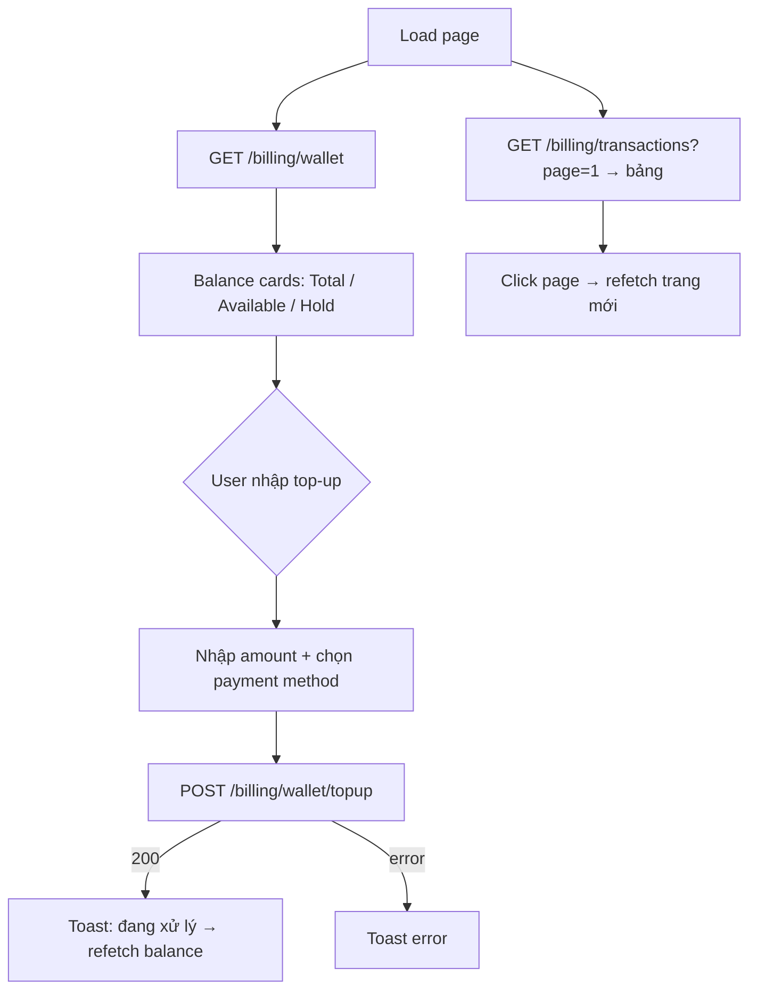
```mermaid
flowchart TD
    A[Load page] --> B[GET /billing/wallet]
    B --> C[Balance cards: Total / Available / Hold]
    A --> D[GET /billing/transactions?page=1 → bảng]

    C --> E{User nhập top-up}
    E --> F[Nhập amount + chọn payment method]
    F --> G[POST /billing/wallet/topup]
    G -->|200| H[Toast: đang xử lý → refetch balance]
    G -->|error| I[Toast error]

    D --> J[Click page → refetch trang mới]
```

---

### `/dashboard/profile`
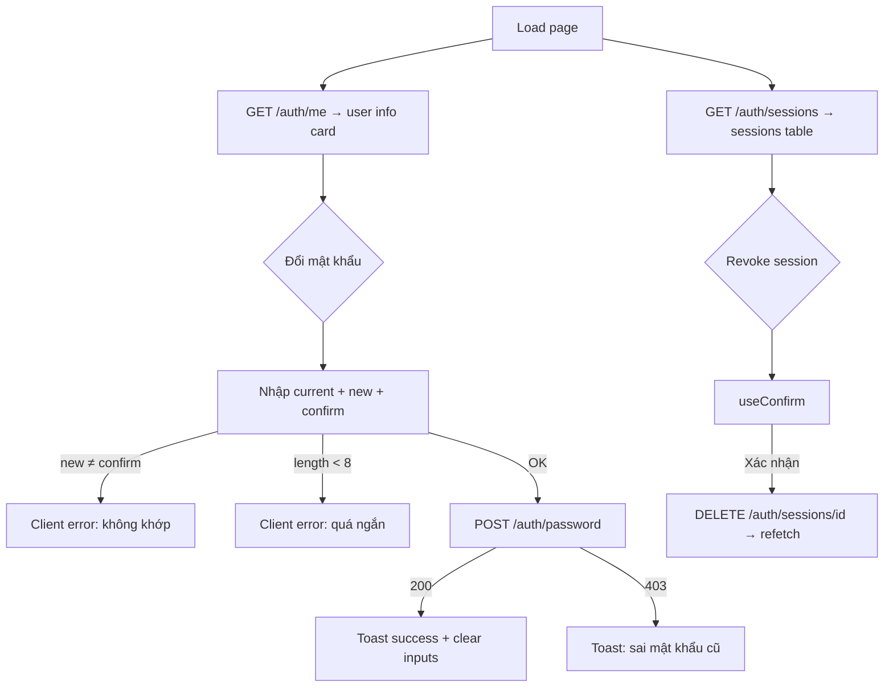
```mermaid
flowchart TD
    A[Load page] --> B[GET /auth/me → user info card]
    A --> C[GET /auth/sessions → sessions table]

    B --> D{Đổi mật khẩu}
    D --> E[Nhập current + new + confirm]
    E -->|new ≠ confirm| F[Client error: không khớp]
    E -->|length < 8| G[Client error: quá ngắn]
    E -->|OK| H[POST /auth/password]
    H -->|200| I[Toast success + clear inputs]
    H -->|403| J[Toast: sai mật khẩu cũ]

    C --> K{Revoke session}
    K --> L[useConfirm]
    L -->|Xác nhận| M[DELETE /auth/sessions/id → refetch]
```

---

## Reseller Flows

### `/reseller` (Dashboard)
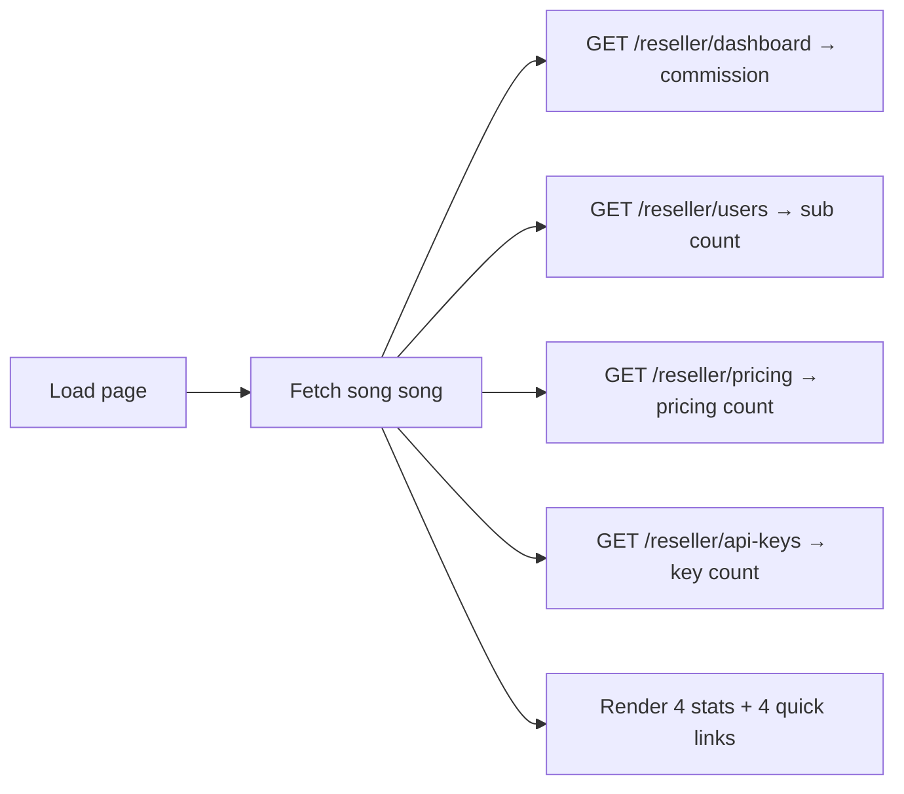
```mermaid
flowchart LR
    A[Load page] --> B[Fetch song song]
    B --> C[GET /reseller/dashboard → commission]
    B --> D[GET /reseller/users → sub count]
    B --> E[GET /reseller/pricing → pricing count]
    B --> F[GET /reseller/api-keys → key count]
    B --> G[Render 4 stats + 4 quick links]
```

---

### `/reseller/accounts`
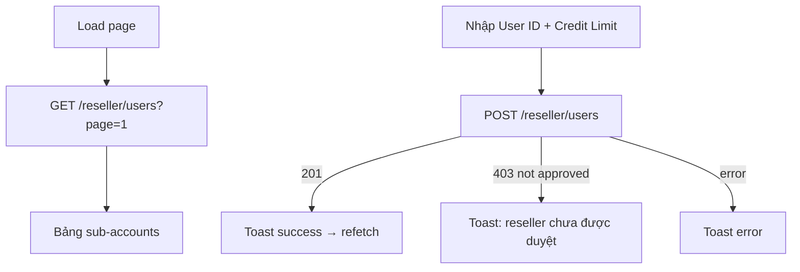
```mermaid
flowchart TD
    A[Load page] --> B[GET /reseller/users?page=1]
    B --> C[Bảng sub-accounts]

    D[Nhập User ID + Credit Limit] --> E[POST /reseller/users]
    E -->|201| F[Toast success → refetch]
    E -->|403 not approved| G[Toast: reseller chưa được duyệt]
    E -->|error| H[Toast error]
```

---

### `/reseller/pricing`
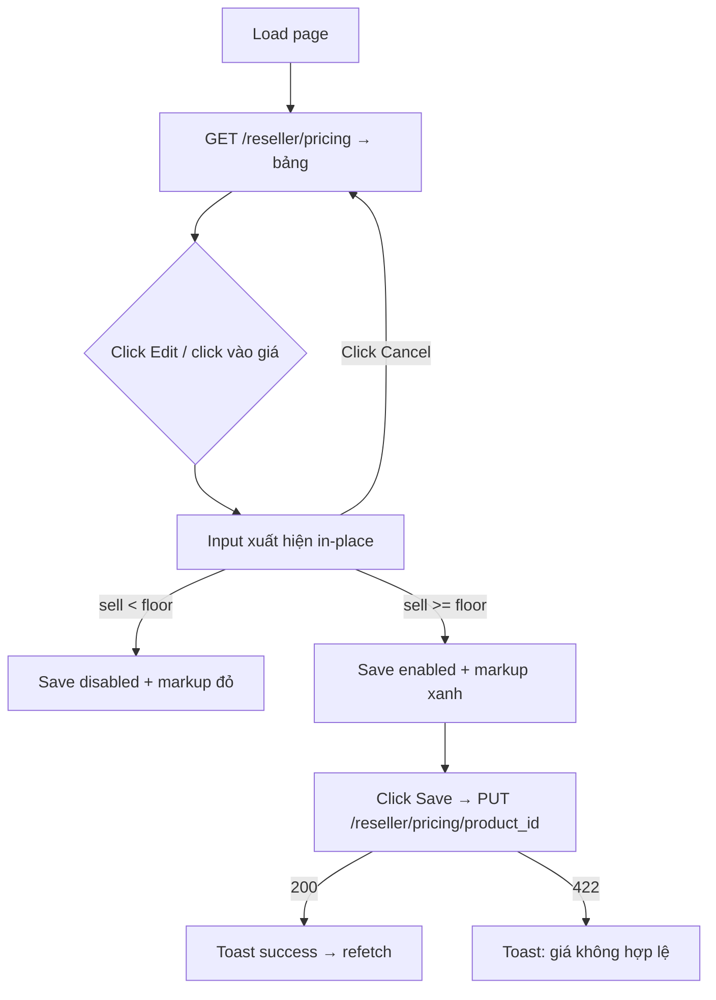
```mermaid
flowchart TD
    A[Load page] --> B[GET /reseller/pricing → bảng]
    B --> C{Click Edit / click vào giá}
    C --> D[Input xuất hiện in-place]
    D -->|sell < floor| E[Save disabled + markup đỏ]
    D -->|sell >= floor| F[Save enabled + markup xanh]
    F --> G[Click Save → PUT /reseller/pricing/product_id]
    G -->|200| H[Toast success → refetch]
    G -->|422| I[Toast: giá không hợp lệ]
    D -->|Click Cancel| B
```

---

### `/reseller/api-keys`
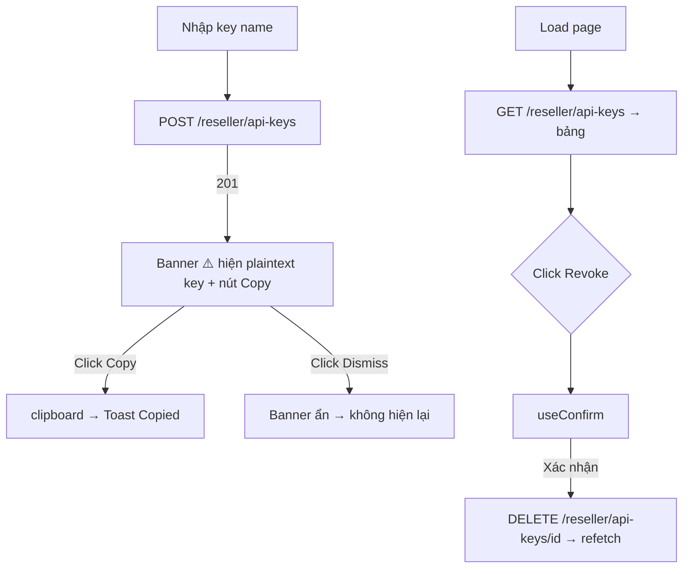
```mermaid
flowchart TD
    A[Load page] --> B[GET /reseller/api-keys → bảng]

    C[Nhập key name] --> D[POST /reseller/api-keys]
    D -->|201| E[Banner ⚠️ hiện plaintext key + nút Copy]
    E -->|Click Copy| F[clipboard → Toast Copied]
    E -->|Click Dismiss| G[Banner ẩn → không hiện lại]

    B --> H{Click Revoke}
    H --> I[useConfirm]
    I -->|Xác nhận| J[DELETE /reseller/api-keys/id → refetch]
```

---

### `/reseller/webhooks`
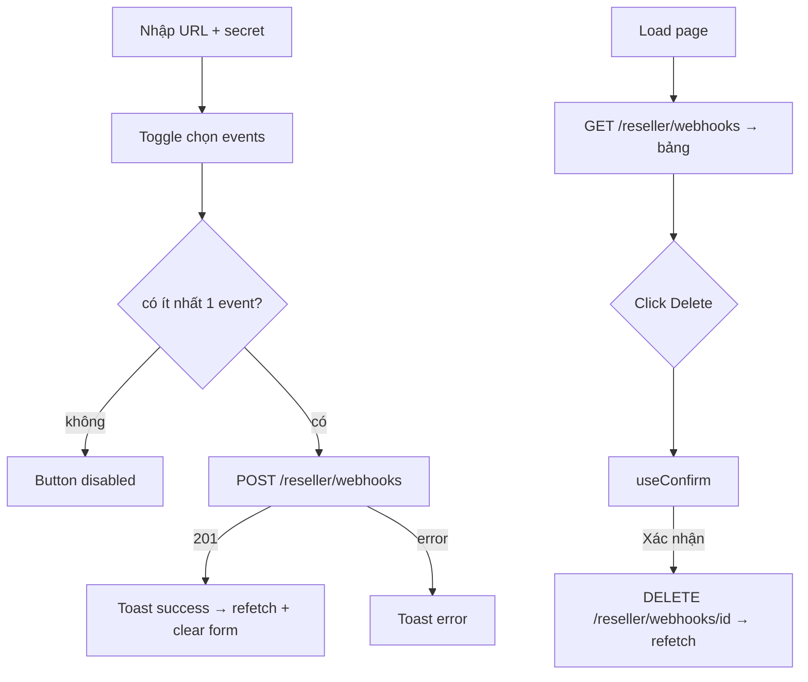
```mermaid
flowchart TD
    A[Load page] --> B[GET /reseller/webhooks → bảng]

    C[Nhập URL + secret] --> D[Toggle chọn events]
    D --> E{có ít nhất 1 event?}
    E -->|không| F[Button disabled]
    E -->|có| G[POST /reseller/webhooks]
    G -->|201| H[Toast success → refetch + clear form]
    G -->|error| I[Toast error]

    B --> J{Click Delete}
    J --> K[useConfirm]
    K -->|Xác nhận| L[DELETE /reseller/webhooks/id → refetch]
```

---

## Admin Flows

### `/admin`
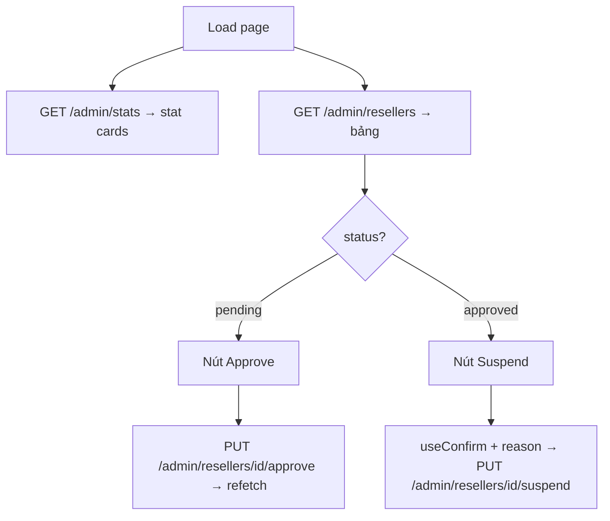
```mermaid
flowchart TD
    A[Load page] --> B[GET /admin/stats → stat cards]
    A --> C[GET /admin/resellers → bảng]

    C --> D{status?}
    D -->|pending| E[Nút Approve]
    D -->|approved| F[Nút Suspend]

    E --> G[PUT /admin/resellers/id/approve → refetch]
    F --> H[useConfirm + reason → PUT /admin/resellers/id/suspend]
```

---

### `/admin/users`
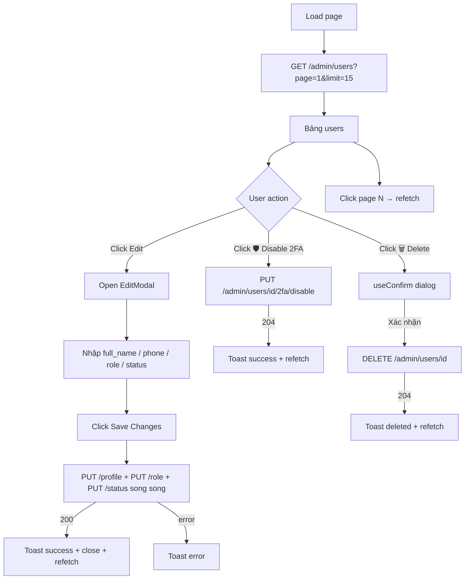
```mermaid
flowchart TD
    A[Load page] --> B[GET /admin/users?page=1&limit=15]
    B --> C[Bảng users]

    C --> D{User action}

    D -->|Click Edit| E[Open EditModal]
    E --> E1[Nhập full_name / phone / role / status]
    E1 --> E2[Click Save Changes]
    E2 --> E3[PUT /profile + PUT /role + PUT /status song song]
    E3 -->|200| E4[Toast success + close + refetch]
    E3 -->|error| E5[Toast error]

    D -->|Click 🛡️ Disable 2FA| TFA[PUT /admin/users/id/2fa/disable]
    TFA -->|204| TFA2[Toast success + refetch]

    D -->|Click 🗑️ Delete| DEL[useConfirm dialog]
    DEL -->|Xác nhận| DEL2[DELETE /admin/users/id]
    DEL2 -->|204| DEL3[Toast deleted + refetch]

    C --> P[Click page N → refetch]
```

---

### `/admin/proxy`
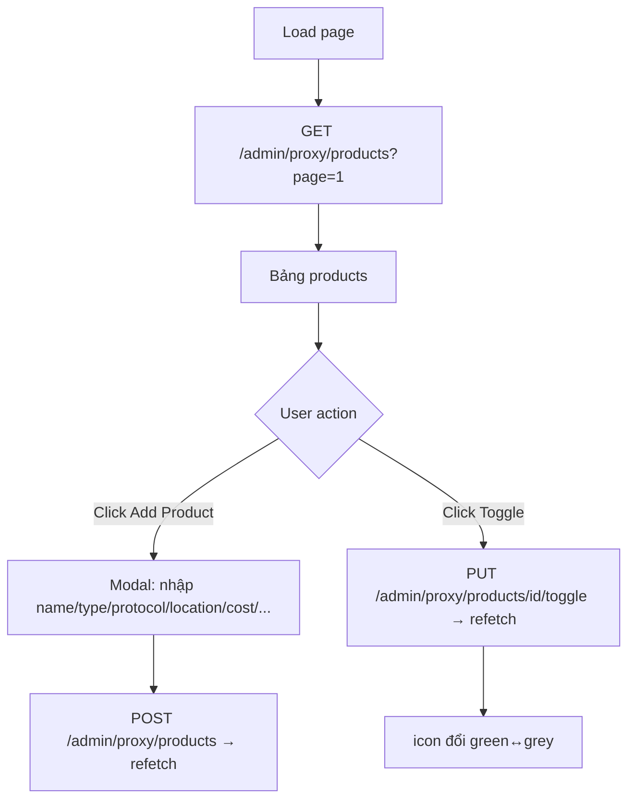
```mermaid
flowchart TD
    A[Load page] --> B[GET /admin/proxy/products?page=1]
    B --> C[Bảng products]

    C --> D{User action}
    D -->|Click Add Product| E[Modal: nhập name/type/protocol/location/cost/...]
    E --> F[POST /admin/proxy/products → refetch]

    D -->|Click Toggle| G[PUT /admin/proxy/products/id/toggle → refetch]
    G --> H[icon đổi green↔grey]
```

---

### `/admin/vps`
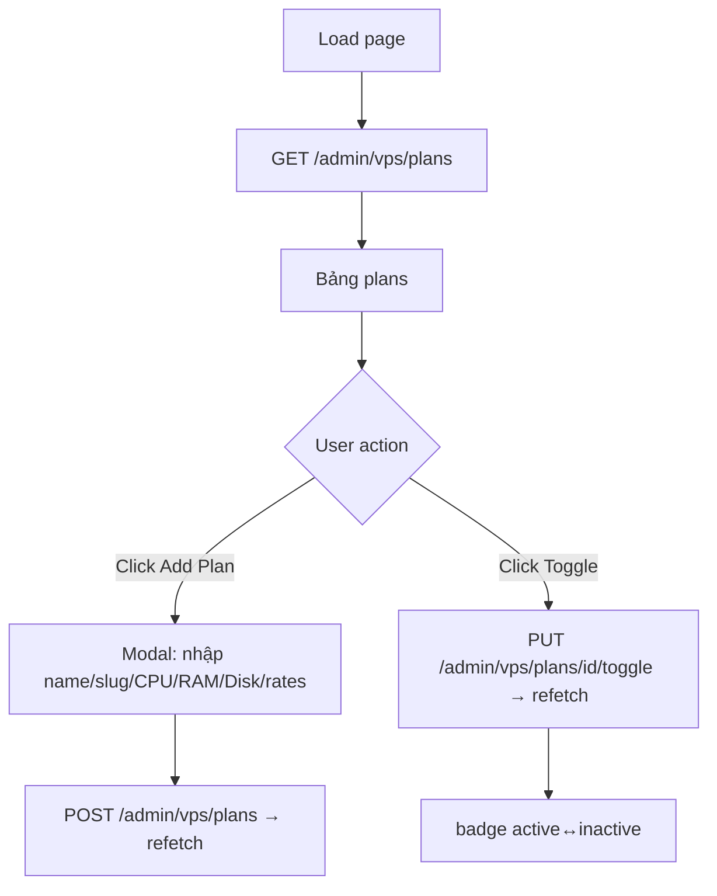
```mermaid
flowchart TD
    A[Load page] --> B[GET /admin/vps/plans]
    B --> C[Bảng plans]

    C --> D{User action}
    D -->|Click Add Plan| E[Modal: nhập name/slug/CPU/RAM/Disk/rates]
    E --> F[POST /admin/vps/plans → refetch]

    D -->|Click Toggle| G[PUT /admin/vps/plans/id/toggle → refetch]
    G --> H[badge active↔inactive]
```

---

## Global Flows

### Token Refresh (tự động)
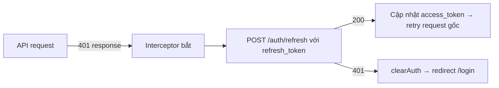
```mermaid
flowchart LR
    A[API request] -->|401 response| B[Interceptor bắt]
    B --> C[POST /auth/refresh với refresh_token]
    C -->|200| D[Cập nhật access_token → retry request gốc]
    C -->|401| E[clearAuth → redirect /login]
```

### Error Handling
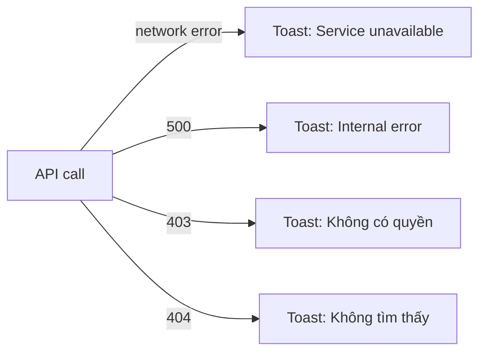
```mermaid
flowchart LR
    A[API call] -->|network error| B[Toast: Service unavailable]
    A -->|500| C[Toast: Internal error]
    A -->|403| D[Toast: Không có quyền]
    A -->|404| E[Toast: Không tìm thấy]
```
